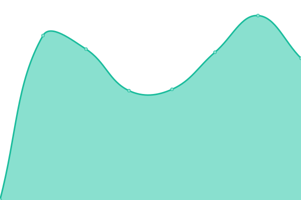
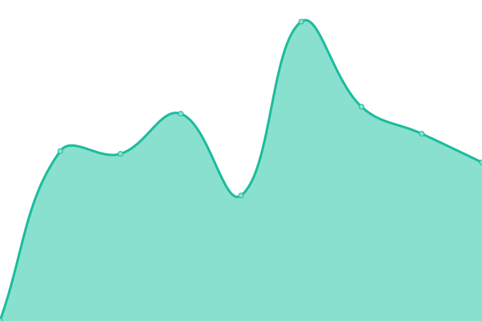
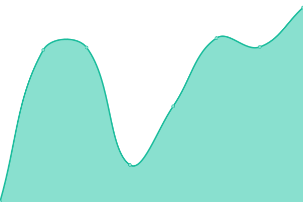
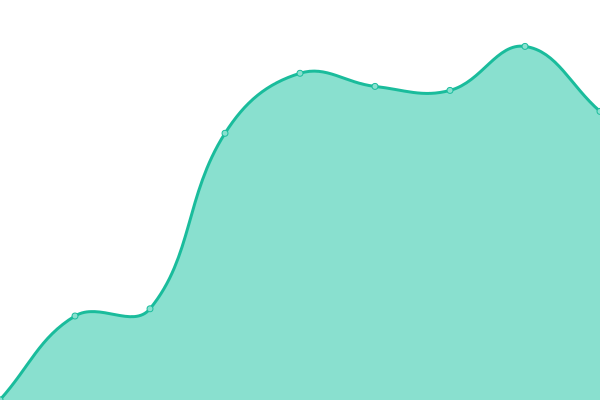
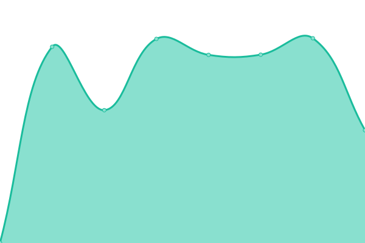
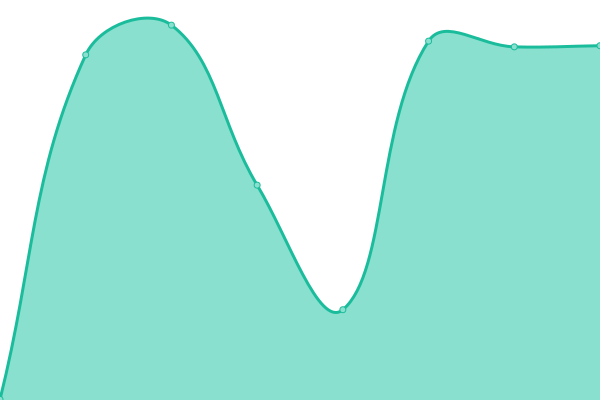
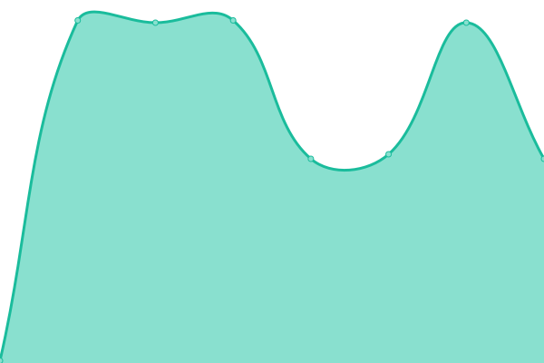
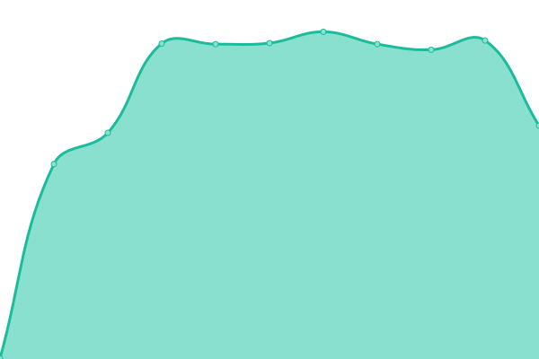
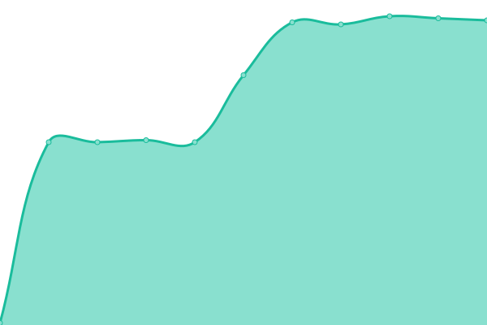

# [📈 Live Status](https://status.kescher.at): <!--live status--> **🟩 All systems operational**

This repository contains the open-source uptime monitor and status page for [Jeremy Kescher](https://kescher.at), powered by [Upptime](https://github.com/upptime/upptime).

With [Upptime](https://upptime.js.org), you can get your own unlimited and free uptime monitor and status page, powered entirely by a GitHub repository. We use [Issues](https://github.com/kescherCode/status/issues) as incident reports, [Actions](https://github.com/kescherCode/status/actions) as uptime monitors, and [Pages](https://status.kescher.at) for the status page.

<!--start: status pages-->
<!-- This summary is generated by Upptime (https://github.com/upptime/upptime) -->
<!-- Do not edit this manually, your changes will be overwritten -->
<!-- prettier-ignore -->
| URL | Status | History | Response Time | Uptime |
| --- | ------ | ------- | ------------- | ------ |
|  [kescher.at](https://www.kescher.at) | 🟩 Up | [kescher-at.yml](https://github.com/kescherCode/status/commits/HEAD/history/kescher-at.yml) | 

 551ms
     
 | 

<a href="https://status.kescher.at/history/kescher-at">100.00%</a>
    

|  [kescherCloud](https://cloud.kescher.at/status.php) | 🟩 Up | [kescher-cloud.yml](https://github.com/kescherCode/status/commits/HEAD/history/kescher-cloud.yml) | 

 1105ms
     
 | 

<a href="https://status.kescher.at/history/kescher-cloud">99.91%</a>
    

|  [kescherGit](https://git.kescher.at/api/v1/version) | 🟩 Up | [kescher-git.yml](https://github.com/kescherCode/status/commits/HEAD/history/kescher-git.yml) | 

 518ms
     
 | 

<a href="https://status.kescher.at/history/kescher-git">100.00%</a>
    

|  [Magnetico](https://magnetico.kescher.at/api/v0.1/torrents/) | 🟩 Up | [magnetico.yml](https://github.com/kescherCode/status/commits/HEAD/history/magnetico.yml) | 

 629ms
     
 | 

<a href="https://status.kescher.at/history/magnetico">100.00%</a>
    

|  [Doggos frontend](https://doggos.kescher.at) | 🟩 Up | [doggos-frontend.yml](https://github.com/kescherCode/status/commits/HEAD/history/doggos-frontend.yml) | 

 577ms
     
 | 

<a href="https://status.kescher.at/history/doggos-frontend">100.00%</a>
    

|  [Doggos BETA frontend](https://beta.doggos.kescher.at) | 🟩 Up | [doggos-beta-frontend.yml](https://github.com/kescherCode/status/commits/HEAD/history/doggos-beta-frontend.yml) | 

 557ms
     
 | 

<a href="https://status.kescher.at/history/doggos-beta-frontend">99.94%</a>
    

|  [Doggos backend - Salt Lake](https://doggos.kescher.at/sl-small-dog-patio.mjpg) | 🟩 Up | [doggos-backend-salt-lake.yml](https://github.com/kescherCode/status/commits/HEAD/history/doggos-backend-salt-lake.yml) | 

 5058ms
     
 | 

<a href="https://status.kescher.at/history/doggos-backend-salt-lake">99.35%</a>
    

|  [Doggos backend - Woods Cross](https://doggos.kescher.at/wc-lazy-lounge.mjpg) | 🟩 Up | [doggos-backend-woods-cross.yml](https://github.com/kescherCode/status/commits/HEAD/history/doggos-backend-woods-cross.yml) | 

 1430ms
     
 | 

<a href="https://status.kescher.at/history/doggos-backend-woods-cross">100.00%</a>
    

|  [Matrix](https://matrix.kescher.at) | 🟩 Up | [matrix.yml](https://github.com/kescherCode/status/commits/HEAD/history/matrix.yml) | 

 754ms
     
 | 

<a href="https://status.kescher.at/history/matrix">100.00%</a>
    

|  [arch4edu mirror https](https://arch4edu.mirror.kescher.at/lastupdate) | 🟩 Up | [arch4edu-mirror-https.yml](https://github.com/kescherCode/status/commits/HEAD/history/arch4edu-mirror-https.yml) | 

 522ms
     
 | 

<a href="https://status.kescher.at/history/arch4edu-mirror-https">99.94%</a>
    

|  [arch4edu mirror rsync](arch4edu.mirror.kescher.at) | 🟩 Up | [arch4edu-mirror-rsync.yml](https://github.com/kescherCode/status/commits/HEAD/history/arch4edu-mirror-rsync.yml) | 

 122ms
     
 | 

<a href="https://status.kescher.at/history/arch4edu-mirror-rsync">100.00%</a>
    

|  [arch mirror https](https://arch.mirror.kescher.at/lastupdate) | 🟩 Up | [arch-mirror-https.yml](https://github.com/kescherCode/status/commits/HEAD/history/arch-mirror-https.yml) | 

 510ms
     
 | 

<a href="https://status.kescher.at/history/arch-mirror-https">99.94%</a>
    

|  [arch mirror rsync](arch.mirror.kescher.at) | 🟩 Up | [arch-mirror-rsync.yml](https://github.com/kescherCode/status/commits/HEAD/history/arch-mirror-rsync.yml) | 

 121ms
     
 | 

<a href="https://status.kescher.at/history/arch-mirror-rsync">100.00%</a>
    

|  [Monero node](unova.kescher.at) | 🟩 Up | [monero-node.yml](https://github.com/kescherCode/status/commits/HEAD/history/monero-node.yml) | 

 121ms
     
 | 

<a href="https://status.kescher.at/history/monero-node">100.00%</a>
    

<!--end: status pages-->

[**Visit our status website →**](https://status.kescher.at)

## 📄 License

- Powered by: [Upptime](https://github.com/upptime/upptime)
- Code: [MIT](./LICENSE) © [Jeremy Kescher](https://kescher.at)
- Data in the `./history` directory: [Open Database License](https://opendatacommons.org/licenses/odbl/1-0/)
